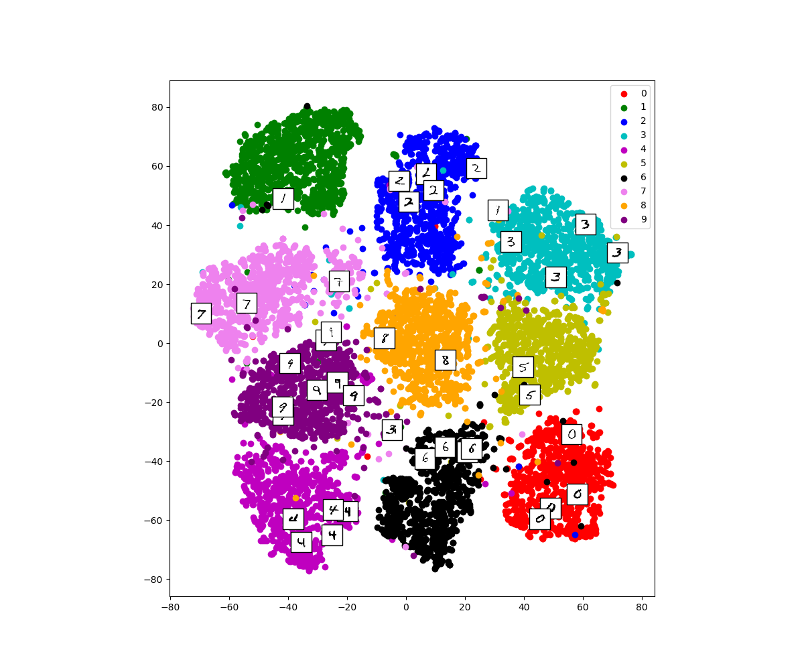

# Momentum Contrast (MoCo)

This repository is the code of "Momentum Contrast for Unsupervised Visual Representation Learning"

We trained and tested the model on two datasets: MNIST and ShapeNet(Partial)

# How to use

The code contains two parts: training part (`train.py`) and testing part (`test.py`)

## Preliminaries

You must install following packages before you can run this code:
```
numpy, pytorch, torchvision, Pillow, tqdm, scikit-learn, matplotlib, opencv-python, glob
```
The requirements can also be found in `requirements.txt`

## Train MoCo

cd to MoCo directory and run the following script.

### To train under `MNIST` dataset:
```python
python train.py -d='MNIST'
```

If you want to specify other parameters like output directory, beta value, queue length, and batchsize, you can add them as arguments:
```python
python train.py -d='MNIST' -e=1000 -bs=100 -q=128 -b=0.999 -e='result/' 
```

### To train under `ShapeNet` dataset:
To train on this dataset you have to specify the dir of the dataset.
```python
python train.py -d='ShapeNet' -dir='your_directory_to_dataset'
```

If you want to specify other parameters like epoch number, beta value, queue length, and batchsize, you can add them as arguments:
```python
python train.py -d='ShapeNet' -dir='your_directory_to_dataset' -e=1000 -bs=100 -q=128 -b=0.999
```

Note that the default values for batchsize, queue length and beta are the best hyperparameter we tuned for this model.

## Test MoCo

To run `test.py`, you have to specify the dataset to test on, the directory of your dataset (If using ShapeNet, not required for MNIST), and the trained model you want to use

```python
python test.py -d='ShapeNet' -dir='your_directory_to_dataset' -e=1000 -q=128 -b=0.999
```

Note that `-dir` is not required for `MNIST` dataset. And `epoch, queue_length, beta` are used to determine which trained model to test on.

The results are showed in `output.txt` with train and test accuracy.

## Visualization

This is an example of visualization of MNIST dataset -- We use TSNE to visualize the dataset

To get this image, simply uncomment 108 - 110 lines of `test.py`.


